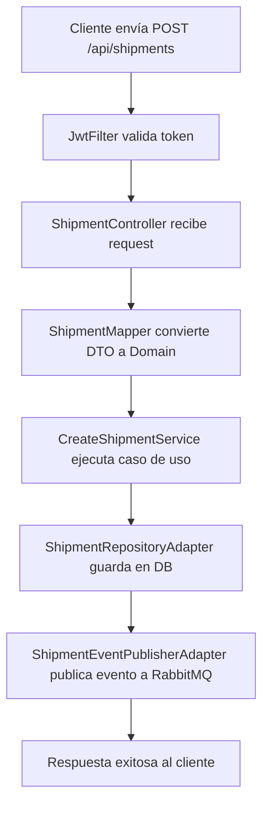
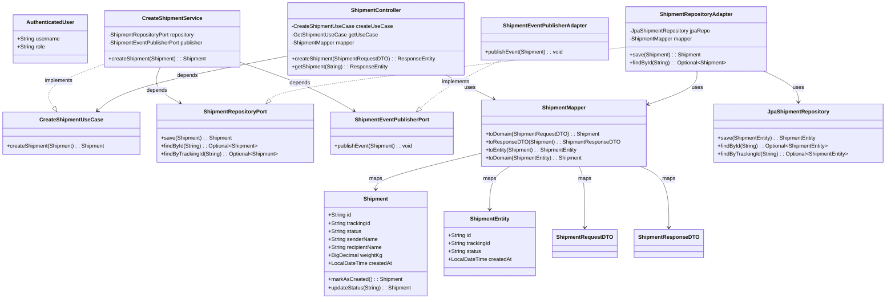

# PaqueTrack - Shipment Service

## Descripción

El **Shipment Service** es un microservicio desarrollado con Spring Boot para la gestión de envíos en el sistema PaqueTrack. Implementa Arquitectura Hexagonal (Ports and Adapters) para mantener una separación clara entre el dominio de negocio y las tecnologías externas. Permite crear, consultar y gestionar envíos con funcionalidades de auditoría, validación y publicación de eventos.

El servicio está construido con Java 21, Spring Boot 3.3.5, y utiliza JPA para persistencia, Flyway para migraciones de base de datos, RabbitMQ para mensajería, y JWT para autenticación. Incluye pruebas automatizadas con Karate y documentación API con Swagger.

## Arquitectura de Alto Nivel

El servicio sigue los principios de Arquitectura Hexagonal:

- **Dominio (Domain)**: Contiene la lógica de negocio pura, entidades inmutables, y puertos (interfaces) que definen contratos.
- **Aplicación (Application)**: Implementa los casos de uso (servicios de aplicación) que orquestan la lógica de dominio.
- **Infraestructura (Infrastructure)**: Contiene los adaptadores que implementan los puertos, incluyendo controladores REST, repositorios JPA, publicadores de eventos, y configuraciones.

### Principios Arquitectónicos

- **Inmutabilidad**: Las entidades del dominio son inmutables, utilizando el patrón Builder.
- **Puertos y Adaptadores**: Los puertos definen interfaces en el dominio; los adaptadores las implementan en la infraestructura.
- **Separación de Responsabilidades**: Cada capa tiene un propósito específico, facilitando pruebas y mantenibilidad.
- **Dependencias hacia el Interior**: Las capas externas dependen de las internas, no al revés.

## Tecnologías Utilizadas

- **Lenguaje**: Java 21 (LTS)
- **Framework**: Spring Boot 3.3.5
- **Gestión de Dependencias**: Maven
- **Base de Datos**: JPA/Hibernate con Flyway para migraciones
- **Mensajería**: RabbitMQ (para eventos de envío)
- **Seguridad**: JWT con Spring Security
- **Validación**: Bean Validation
- **Documentación API**: Swagger/OpenAPI
- **Monitoreo**: Spring Boot Actuator
- **Pruebas**: JUnit, Mockito, Karate
- **Contenedorización**: Docker

## Estructura del Proyecto

```
src/main/java/com/paquetrack/shipment/
├── ShipmentApplication.java              # Clase principal de Spring Boot
├── application/
│   └── service/                          # Servicios de aplicación (casos de uso)
│       ├── CreateShipmentService.java
│       ├── GetShipmentByTrackingService.java
│       └── GetShipmentService.java
├── domain/
│   ├── exception/
│   │   └── ShipmentNotFoundException.java # Excepciones de dominio
│   ├── model/
│   │   ├── AuthenticatedUser.java        # Entidad de usuario autenticado
│   │   └── Shipment.java                 # Entidad principal de envío
│   └── port/
│       └── in/                           # Puertos de entrada (use cases)
│           ├── CreateShipmentUseCase.java
│           ├── GetShipmentByTrackingUseCase.java
│           └── GetShipmentUseCase.java
└── infrastructure/
    ├── config/                           # Configuraciones Spring
    │   ├── BeanConfig.java
    │   ├── JwtProperties.java
    │   ├── RabbitMQConfig.java
    │   ├── SecurityConfig.java
    │   └── SwaggerConfig.java
    ├── controller/
    │   ├── GlobalExceptionHandler.java   # Manejo global de excepciones
    │   └── ShipmentController.java       # Controlador REST
    ├── dto/
    │   ├── ErrorResponseDTO.java         # DTO de respuesta de error
    │   ├── ShipmentRequestDTO.java       # DTO de solicitud
    │   └── ShipmentResponseDTO.java      # DTO de respuesta
    ├── persistence/
    │   ├── adapter/
    │   │   ├── ShipmentEventPublisherAdapter.java # Adaptador para publicación de eventos
    │   │   └── ShipmentRepositoryAdapter.java      # Adaptador de repositorio
    │   ├── entity/
    │   │   └── ShipmentEntity.java       # Entidad JPA
    │   ├── mapper/
    │   │   └── ShipmentMapper.java       # Mapeador entre dominio, DTO y entidad
    │   └── repository/
    │       └── JpaShipmentRepository.java # Repositorio JPA
    └── security/
        ├── JwtAdapter.java               # Adaptador JWT
        └── JwtFilter.java                # Filtro de seguridad JWT
```

### Módulos Principales

- **Entidades de Dominio**: `Shipment` (inmutable, con métodos de negocio), `AuthenticatedUser`.
- **Puertos de Entrada**: Interfaces para casos de uso (e.g., `CreateShipmentUseCase`).
- **Servicios de Aplicación**: Implementaciones de casos de uso, orquestando dominio y puertos de salida.
- **Adaptadores de Infraestructura**: Controladores REST, repositorios JPA, publicadores de eventos, mapeadores, configuraciones de seguridad.

## Diagramas

### Diagrama de Flujo de Creación de Envío



### Diagrama de Clases / Componentes



**Relaciones**:
- **Implementación**: Servicios de aplicación implementan puertos de entrada; adaptadores implementan puertos de salida.
- **Dependencia**: Capas externas dependen de las internas (e.g., `ShipmentController` depende de `CreateShipmentUseCase`).
- **Composición**: Adaptadores componen repositorios y mapeadores (e.g., `ShipmentRepositoryAdapter` usa `JpaShipmentRepository` y `ShipmentMapper`).
- **Mapeo**: `ShipmentMapper` maneja conversiones entre dominio, infraestructura y presentación.
- **Agregación**: Entidades del dominio son centrales, referenciadas por servicios y adaptadores.

## Instalación y Configuración

### Prerrequisitos

- Java 21 LTS
- Maven 3.8+
- PostgreSQL
- RabbitMQ (opcional, para eventos)

### Configuración

1. Clonar el repositorio y navegar al directorio del servicio.
2. Configurar `application.yml` o variables de entorno para base de datos y RabbitMQ.

Ejemplo de configuración:

```yaml
spring:
  datasource:
    url: jdbc:postgresql://localhost:5432/shipmentdb
    username: user
    password: pass
  jpa:
    hibernate:
      ddl-auto: validate
  rabbitmq:
    host: localhost
    port: 5672
jwt:
  secret: your-secret-key
```

### Construcción y Ejecución

```bash
mvn clean install
mvn spring-boot:run
```

### Pruebas

```bash
mvn test  # Incluye pruebas unitarias y Karate
```

## API Endpoints

Documentados con Swagger en `/swagger-ui.html`.

- `POST /api/shipments`: Crear envío (requiere autenticación JWT)
- `GET /api/shipments/{id}`: Obtener envío por ID
- `GET /api/shipments/tracking/{trackingId}`: Obtener por tracking ID

Ejemplo de request:

```json
{
  "senderName": "Juan Pérez",
  "senderAddress": "Calle 123",
  "recipientName": "Ana Gómez",
  "recipientAddress": "Avenida 456",
  "weightKg": 2.5
}
```

## Monitoreo

- `/actuator/health`: Estado del servicio
- `/actuator/info`: Información del servicio

## Seguridad

- Autenticación JWT requerida para endpoints de creación.
- Configuración en `SecurityConfig.java` y `JwtFilter.java`.

## Documentación en Swagger
`https://shipment-service-sena.onrender.com/swagger-ui.html `
